<picture>
  <source media="(prefers-color-scheme: dark)" srcset="./assets/header-dark.svg">
  
</picture>

 

### 📈 GitHub stats

  

### 🚀 Featured projects

<table>
  <tr>
    <td width="50%" valign="top">
      <h4>🤖 <a href="https://github.com/danilablagorodniy37/AutoIndeed">AutoIndeed</a></h4>
      A semi-automated job application helper. A visible browser fills in Indeed Apply forms from my profile, a growing answer store and Claude, and leaves anything it is unsure about for me to review.
        <code>Python</code> <code>Playwright</code> <code>Claude API</code>
    </td>
    <td width="50%" valign="top">
      <h4>🌦️ <a href="https://github.com/danilablagorodniy37/BSU">Weather data pipeline</a></h4>
      A command line pipeline that validates a year of raw weather observations, derives daily metrics and writes a summary report. Ships as a single <code>.exe</code>.
        <code>Python</code> <code>CSV</code> <code>PyInstaller</code>
    </td>
  </tr>
  <tr>
    <td width="50%" valign="top">
      <h4>📊 <a href="https://github.com/danilablagorodniy37/User-Behavior-Analysis-for-Kindred-Group">User behavior analysis</a></h4>
      Engagement, session length and churn of the users of an online betting platform, explored on synthetic data in a notebook.
        <code>Python</code> <code>pandas</code> <code>Jupyter</code>
    </td>
    <td width="50%" valign="top">
      <h4>🛠️ <a href="https://github.com/danilablagorodniy37/SimpleTool">SimpleTool</a></h4>
      A small desktop app that switches off Windows telemetry, ads and sync with one click each.
        <code>Python</code> <code>Tkinter</code> <code>PowerShell</code>
    </td>
  </tr>
</table>

<a href="https://github.com/danilablagorodniy37?tab=repositories">more in my repositories →</a>

### 🐍 My contributions, eaten

<picture>
  <source media="(prefers-color-scheme: dark)" srcset="https://raw.githubusercontent.com/danilablagorodniy37/danilablagorodniy37/output/github-snake-dark.svg">
  
</picture>

💚 thanks for stopping by

